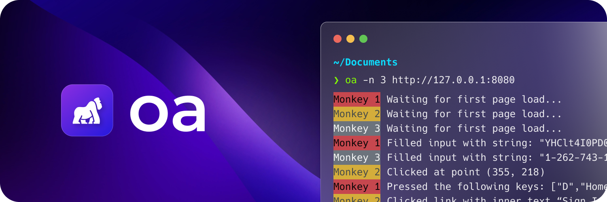

`oa` (short for ["oo oo aa aa"](https://www.youtube.com/watch?v=yb8ZAP5JCuk)) is a simple command-line tool for monkey testing frontend applications. 

[Monkey testing](https://en.wikipedia.org/wiki/Monkey_testing) is a technique in which random click, input and keyboard events are sent to an application to test its resilience. In other words, as if a monkey was using it. Monkey testing can also be helpful for adding an increased load to the application to debug performance and memory bottlenecks.

Unlike other load testing tools, `oa` uses [Puppeteer](https://pptr.dev) under-the-hood to run your website in a real browser environment. While the browser is hidden by default, you can choose to show it via the `--show` flag.

**Disclaimer: this tool is intended primarily for use on local websites. Attempting to run `oa` on a hosted website, especially one you don't own, is a good way to get your IP blocked.**

## Installation 

Until official binaries can be released, the easiest way to install `oa` is from Deno itself:

```bash
deno install --allow-env --allow-write --allow-read --allow-run --allow-net https://deno.land/x/oa2
```

## Usage

Using `oa` is fairly straightforward. You can test a website using the default options by just passing the URL to the command:

```bash
oa http://127.0.0.1:8080/login
```

## Flags

`oa` supports a few flags to customize its behavior:

| Name              | Alias | Description                                                                              | Default |
| ----------------- | ----- | ---------------------------------------------------------------------------------------- | ------- |
| `--show`          | `-s`  | Show the browser window while testing.                                                   | `false` |
| `--num`           | `-n`  | The number of monkeys/instances to run.                                                  | 1       |
| `--duration`      | `-d`  | The duration to run the test. Supports human-readable times such as '5m', '1 hour', etc. | 10s     |
| `--header`        | `-H`  | HTTP header to pass to the browser. Can be used multiple times.                          |         |
| `--cookie`        | `-c`  | Cookie string to pass to the browser. Can be used multiple times.                        | 10s     |
| `--skip-links`    | `-L`  | Skip clicking on links.                                                                  | `false` |
| `--skip-inputs`   | `-I`  | Skip filling in inputs.                                                                  | `false` |
| `--skip-clicking` | `-C`  | Skip random clicking on the page.                                                        | `false` |
| `--skip-buttons`  | `-B`  | Skip clicking on buttons.                                                                | `false` |
| `--filter-links`  | `-l`  | Only click on links that contain the provided string.                                    |         |
| `--config-file`   | `-F`  | Path to a configuration file.                                                            |         |

## Configuration File

You can also pass a `oa.config.json` configuration file to `oa` to specify the above options as well:

```json
{
  "$schema": "./oa.schema.json",
  "url": "http://127.0.0.1:8080/login",
  "show": false,
  "cookies": [
    {
      "name": "Key",
      "value": "Value",
      "expiresIn": 5000,
      "domain": "facebook.com"
    }
  ],
  "headers": {
    "Key": "Value"
  },
  "targets": {
    "links": {
      "enabled": true,
      "filter": "/read/1"
    },
    "buttons": {
      "enabled": true
    },
    "inputs": {
      "enabled": true
    },
    "clicking": {
      "enabled": true
    },
    "typing": {
      "enabled": true
    }
  }
}
```

In this case, you just need to run `oa` to start the monkeys. Unless the `--config-file` flag is used, `oa` will look in the current directory for a `oa.config.json` file.